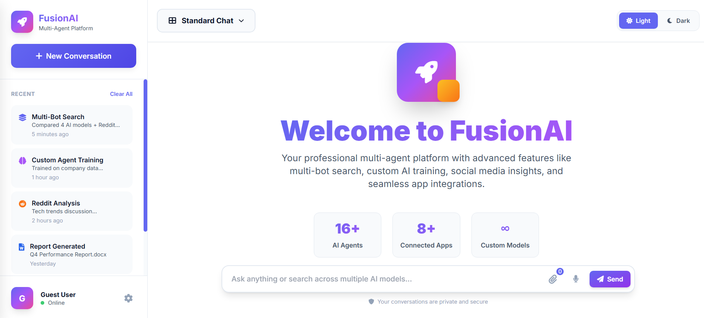
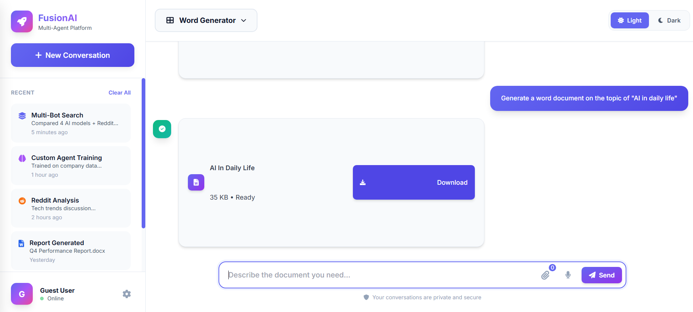
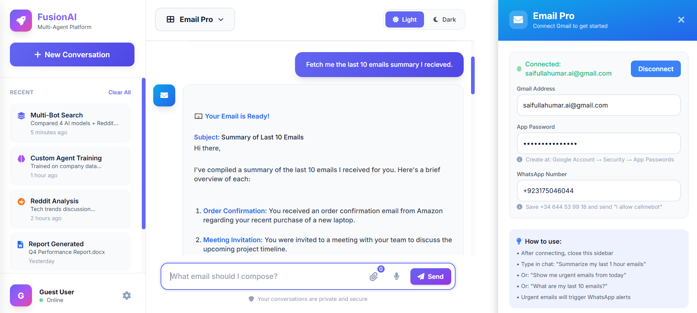

# FusionAI Project

FusionAI is a multifunctional AI assistant platform built with Flask and FastAPI. It combines chat, web search, file handling, document generation, GitHub integration, email automation, and analytics into a single app.

> Note: save your feature screenshots in the `images/` folder and update the image references below if needed.

---

## Key Features

### 1. AI Chat Assistant
- Chat with a Groq-based AI backend using `llm_engine.py`.
- Session history is stored in Flask session and persisted into `database/conversations.json`.
- Supports intent classification for chat, support, report, latest updates, and task handling.
- Includes multi-agent mode via `multi_bot.py` for stronger response coverage.
- Live data lookup through the `tavily` client.



### 2. Web Interface Pages
The app provides a clean web UI with these routes:
- `/` — Landing page
- `/sign_in` — Sign in page
- `/sign_up` — Sign up page
- `/settings` — Settings page
- `/help` — Help page
- `/dashboard` — Dashboard view

### 3. Voice-to-Text Support
- Upload audio files to the `/voice-to-text` endpoint.
- Uses `speech_recognition` to transcribe audio to text.
- Great for voice-enabled chat or voice command input.

### 4. File Analysis
- `/analyze-file` accepts single file uploads and returns a descriptive response.
- `/analyze-multiple-files` accepts multiple files and lists received filenames.
- Supports image, document, PDF, Excel, and text file detection.

### 5. GitHub OAuth & Search Integration
- Connect with GitHub using OAuth.
- Endpoints:
  - `/github/login`
  - `/github/callback`
  - `/github/status`
  - `/github/search/repos`
  - `/github/search/code`
  - `/github/repo/contents`
  - `/github/repo/readme`
  - `/github/repo/commits`
- Search repositories, code, and browse repo contents from the app.

### 6. AI Word Document Generator
- Runs a second service in `word_generator_agent.py` using FastAPI.
- Generate `.docx` files from user prompts.
- Automatically parses topics, page count, font settings, and heading colors.
- Saves generated documents to `generated_files/`.



### 7. Email Pro Automation
- Connect Gmail using app-specific passwords via `/email/connect`.
- Fetch recent emails and summarize them with AI.
- Detect urgent emails and optionally trigger WhatsApp-style alerts.
- Generate email drafts with AI at `/email/generate`.
- Create mailto links and send emails through SMTP.
- Store email configuration in `email_config.json`.



### 8. Dashboard Analytics and History
- `/analytics/summary` provides usage statistics from stored conversations.
- `/history/all` returns saved chat history.
- `/database/users.json` returns sample user records.
- `/feedback/submit` and `/feedback/all` let users send and view feedback.

---

## Project Structure

- `app.py` — Main Flask application and route definitions.
- `llm_engine.py` — Groq and Tavily AI connectors, intent classification, live data search.
- `fusionai.py` — Fusion logic that routes chat requests, handles multi-agent mode, and fetches live data.
- `multi_bot.py` — Multi-agent manager for generating multiple model responses.
- `intent_engine.py` — Intent routing helpers.
- `email_utils.py` — Email fetch/send, urgent email detection, WhatsApp notifier, and config storage.
- `word_generator_agent.py` — FastAPI document generation service.
- `templates/` — HTML templates used by Flask pages.
- `database/` — JSON storage for conversations, feedback, and user data.
- `generated_files/` — Generated Word documents.
- `images/` — Screenshot placeholders for README and app previews.
- `email_config.json` — Email connection configuration file.
- `requirements.txt` — Python dependencies.

---

## Installation

1. Install dependencies:

```bash
python -m pip install -r requirements.txt
```

2. Set the required environment variables in your shell:

```bash
set GROQ_API_KEY=your_groq_api_key
set TAVILY_API_KEY=your_tavily_api_key
set GITHUB_CLIENT_ID=your_github_oauth_client_id
set GITHUB_CLIENT_SECRET=your_github_oauth_client_secret
set GITHUB_REDIRECT_URI=http://localhost:5000/github/callback
```

3. Start the services:

- Start the Flask app:
  ```bash
  python app.py
  ```
- Start the Word Generator service:
  ```bash
  python -m uvicorn word_generator_agent:app --reload --port 8000
  ```
- Or use `start_services.bat` on Windows.

---

## Configuration

- `email_config.json` stores Gmail email, app password, and phone settings.
- `WORD_GENERATOR_URL` in `app.py` should point to the FastAPI word-generation service.
- GitHub OAuth values are read from environment variables in `app.py`.

> Important: Do not commit actual credentials to source control.

---

## How It Works

### Chat Flow
1. The UI sends a message to `/chat`.
2. `app.py` stores session history and calls `fusionai()`.
3. `fusionai.py` classifies intent via `llm_engine.llm_classify()`.
4. Based on intent and multi-agent mode, it calls:
   - `ask_llm()` for standard chat
   - `fetch_live_data()` for real-time info
   - `run_multi_bot()` for multi-agent responses
5. The response is saved to `database/conversations.json` and returned.

### Document Generation Flow
1. User submits a document request to `/generate-word`.
2. `app.py` forwards the request to the FastAPI service at `WORD_GENERATOR_URL`.
3. `word_generator_agent.py` parses the prompt and uses Groq to generate content.
4. Content is converted from Markdown to `.docx` and returned as a file.

### Email Flow
1. Connect email via `/email/connect`.
2. Email settings are saved to `email_config.json`.
3. Summaries and urgent alerts are generated from recent email data.
4. Auto-generated emails can be sent with SMTP using the stored email credentials.

---

## Screenshots

Add your website screenshots here after saving them in `images/`:

- `images/landing-page.png`
- `images/dashboard.png`
- `images/word-generator.png`
- `images/email-pro.png`

Update the Markdown image paths if you use different file names.

---

## Notes

- This project uses both Flask and FastAPI together.
- The AI backend is built around Groq and Tavily clients.
- `database/` stores lightweight JSON data for easy inspection and debugging.
- Some features such as GitHub OAuth and WhatsApp alerts may require valid tokens and external service setup.

---

## Recommended Improvements

- Secure secrets using environment variables or a `.env` file.
- Add frontend validation for file uploads and form input.
- Add authentication for dashboard access.
- Add more robust error handling for email and GitHub APIs.

---

## License

Add your preferred license information here.
